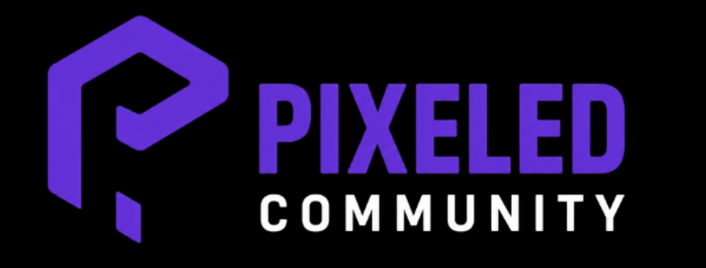

<!DOCTYPE html>
<html lang="es">
<head>
<meta charset="UTF-8">
<meta name="viewport" content="width=device-width, initial-scale=1.0">
<title>Postulación - Pixeled Community</title>
<link href="https://fonts.googleapis.com/css2?family=Rajdhani:wght@500;600;700&family=Nunito:wght@400;500;600&display=swap" rel="stylesheet">

</head>
<body>

  

     
    
PIXELED COMMUNITY

    
Formulario de postulación al servidor

  

  

    

      Datos
      Experiencia
      Personaje
      Test Normas
      Enviar
    

    

  

  

    <!-- PASO 1 -->
    

      
Datos Personales 1 / 5

      

        
<label>Nick de FiveM *</label><input type="text" id="nick" placeholder="Tu nombre en el juego" maxlength="30">Campo obligatorio

        
<label>Discord *</label><input type="text" id="discord" placeholder="@usuario o usuario#0000" maxlength="50">Campo obligatorio

        
<label>Edad real *</label><input type="number" id="edad" placeholder="Tu edad" min="14" max="99">Mínimo 14 años

        
<label>País</label><select id="pais"><option value="">Selecciona tu país</option><option>España</option><option>México</option><option>Argentina</option><option>Colombia</option><option>Chile</option><option>Venezuela</option><option>Perú</option><option>Otro</option></select>

      

      
<button class="btn-next" onclick="nextStep(1)">CONTINUAR →</button>

    

    <!-- PASO 2 -->
    

      
Experiencia en Roleplay 2 / 5

      

        
<label>¿Cuánto tiempo llevas haciendo roleplay? *</label>
<button class="opt-btn" onclick="selectOpt('exp-opts','exp',this)">Soy nuevo</button><button class="opt-btn" onclick="selectOpt('exp-opts','exp',this)">Menos de 1 año</button><button class="opt-btn" onclick="selectOpt('exp-opts','exp',this)">1 - 3 años</button><button class="opt-btn" onclick="selectOpt('exp-opts','exp',this)">Más de 3 años</button>
<input type="hidden" id="exp">Selecciona una opción

        
<label>Servidores anteriores</label><input type="text" id="servidores" placeholder="Ej: NoPixel, Eclipse, otros..." maxlength="100">

        
<label>¿Cómo conociste Pixeled Community? *</label><select id="conoce"><option value="">Selecciona...</option><option>Discord</option><option>Amigo o conocido</option><option>Redes sociales</option><option>YouTube / Twitch</option><option>Otro</option></select>Campo obligatorio

      

      
<button class="btn-back" onclick="prevStep(2)">← VOLVER</button><button class="btn-next" onclick="nextStep(2)">CONTINUAR →</button>

    

    <!-- PASO 3 -->
    

      
Tu Personaje 3 / 5

      

        
<label>Nombre del personaje *</label><input type="text" id="nombre-per" placeholder="Nombre Apellido" maxlength="50">Campo obligatorio

        
<label>Rol deseado</label><select id="trabajo"><option value="">Selecciona un rol</option><option>Civil</option><option>Policía (LSPD)</option><option>Médico (EMS)</option><option>Mecánico</option><option>Empresario</option><option>Criminal</option><option>Sin decidir</option></select>

      

      
<label>Historia del personaje (backstory) *</label><textarea id="backstory" placeholder="¿De dónde viene? ¿Por qué llegó a Los Santos? ¿Qué busca? (mín. 100 caracteres)" maxlength="1000" oninput="updateCount('backstory','bs-count',1000)"></textarea>
Mínimo 100 caracteres0 / 1000

      
<button class="btn-back" onclick="prevStep(3)">← VOLVER</button><button class="btn-next" onclick="nextStep(3)">CONTINUAR →</button>

    

    <!-- PASO 4: TEST -->
    

      
Test de Normas RP 4 / 5

      
Responde las 10 preguntas sobre las normas básicas del roleplay antes de continuar.

      

      

0/10

<strong id="score-msg"></strong> 

      
<button class="btn-back" onclick="prevStep(4)">← VOLVER</button><button class="btn-next" id="btn-check-quiz" onclick="checkQuiz()">COMPROBAR RESPUESTAS</button>

    

    <!-- PASO 5 -->
    

      
Compromisos y Envío 5 / 5

      

        
<label>¿Qué entiendes por "romper el personaje" (OOC)? *</label><textarea id="ooc" placeholder="Explica con tus propias palabras..." maxlength="400" oninput="updateCount('ooc','ooc-count',400)"></textarea>
Campo obligatorio0 / 400

        
<label>¿Para qué se usan /me y /do? Da un ejemplo de cada uno *</label><textarea id="me-do" placeholder="Ej: /me saca la cartera lentamente — /do La puerta está entreabierta..." maxlength="400" oninput="updateCount('me-do','medo-count',400)"></textarea>
Campo obligatorio0 / 400

        
<label>Confirmo que *</label>
          

            <label class="chk-item" id="ci1"><input type="checkbox" id="chk1" onchange="toggleChk('ci1')"> He leído y acepto todas las normas del servidor</label>
            <label class="chk-item" id="ci2"><input type="checkbox" id="chk2" onchange="toggleChk('ci2')"> Tengo micrófono y me comprometo a usarlo siempre en RP</label>
            <label class="chk-item" id="ci3"><input type="checkbox" id="chk3" onchange="toggleChk('ci3')"> Entiendo y respetaré las normas de IC/OOC en todo momento</label>
            <label class="chk-item" id="ci4"><input type="checkbox" id="chk4" onchange="toggleChk('ci4')"> No practicaré metagaming, powergaming, RDM, VDM ni RK</label>
            <label class="chk-item" id="ci5"><input type="checkbox" id="chk5" onchange="toggleChk('ci5')"> Me comprometo a mantener un ambiente respetuoso con todos</label>
          

          Debes aceptar todos los compromisos
        

      

      
<strong>⏱ Plazo de respuesta:</strong> Tu postulación será revisada en <strong>24-72 horas</strong>. Recibirás respuesta por Discord. Pixeled Community se reserva el derecho de aceptar o denegar cualquier postulación.

      
❌ Error al enviar. Comprueba tu conexión e inténtalo de nuevo.

      
<button class="btn-back" onclick="prevStep(5)">← VOLVER</button><button class="btn-next" id="btn-submit" onclick="submitForm()">ENVIAR POSTULACIÓN ✓</button>

    

  

  

    
✓

    <h2>¡Postulación recibida!</h2>
    
Gracias por querer unirte a <strong>Pixeled Community</strong>. Revisaremos tu solicitud y recibirás una respuesta en las próximas <strong>24-72 horas</strong> por Discord.

  

</body>
</html>
